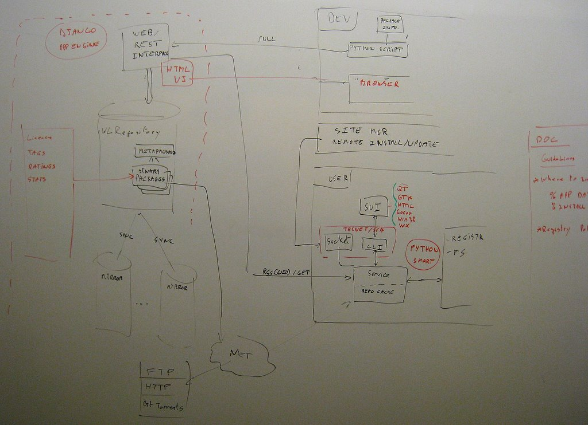

Global Specifications
#####################

Architecture
************

Server
======
  * The package server is a Django App hosted on App Engine.
  * Read more on :ref:`server specifications <server-specs>`

Client
======
  * Python service with a telnet interface
  * GUI: Native/Qt/Gtk client for the telnet service
  * Administration tool: remotly communicating with telnet clients
  * Read more on :ref:`client specifications<client-specs>`

Developper Tools
================
  * Read more on :ref:`developer tools specifications <developer-tools-specs>`

First Schema @ GSoC Mentor Summit 08
====================================

Related project and Links
*************************

Win32 Install Tools
===================
  * NSIS: http://nsis.sourceforge.net/Main_Page
  * Innosetup: http://www.innosetup.com/isinfo.php
  * Wix: http://wix.sourceforge.net/

Automation
==========
  * http://pywinauto.openqa.org/

Package Manager
===============
  * SMART: http://labix.org/smart
  * APPSNAP: http://code.google.com/p/appsnap/
  * Google Update: http://code.google.com/p/update-engine/
